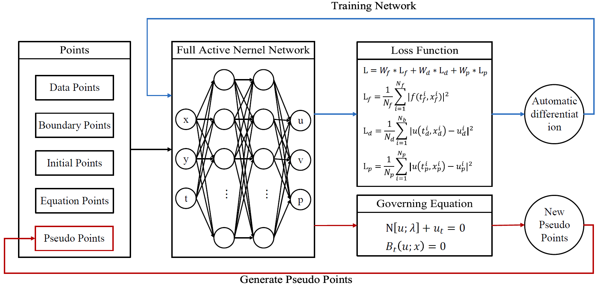
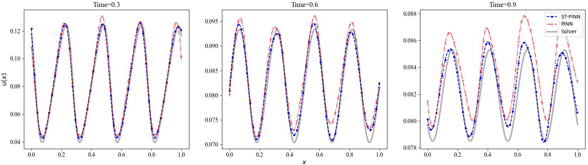
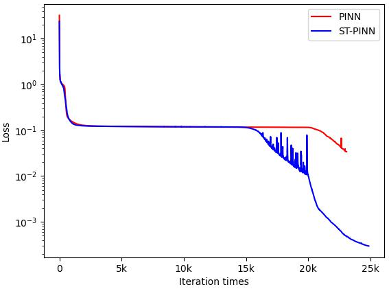
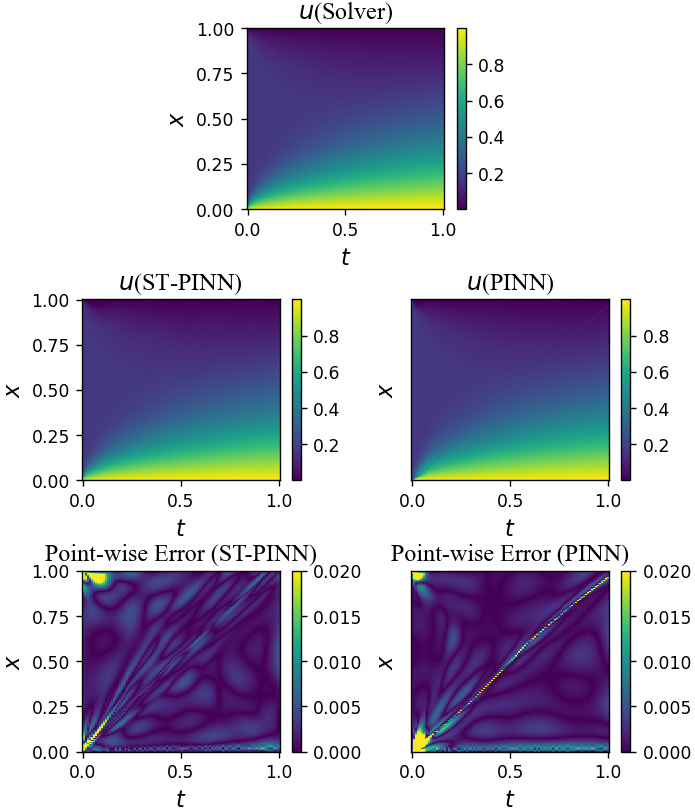

# ST-PINN

An official source code for paper [ST-PINN: A Self-Training Physics-Informed Neural Network for Partial Differential Equations](https://arxiv.org/abs/2306.09389), accepted by the IEEE International Joint Conference on Neural Networks, IJCNN 2023. Any communications or issues are welcomed. Please contact shuaicaijunjun@126.com. If you find this repository useful to your research or work, it is really appreciate to star this repository. :heart:

-------------

### Overview

<p align = "justify"> 
    Partial differential equations (PDEs) are an essential computational kernel in physics and engineering. With the development of deep learning, physics-informed neural networks (PINNs), as a mesh-free method, have shown great potential for fast PDE solving. To address the problem of low accuracy and convergence problems of existing PINNs, we propose a selftraining physics-informed neural network, ST-PINN. Specifically,
ST-PINN introduces a pseudo label based self-learning algorithm during training. It employs governing equation as the pseudolabeled evaluation index and selects the highest confidence example from the sample points to attach the pseudo labels. To the best of our knowledge, we are the first to incorporate a self-training mechanism into physics-informed learning. We conduct experiments on five PDEs problems in different fields and scenarios. The results demonstrate that the proposed method allows the network to learn more physical information and benefit convergence. The ST-PINN outperforms existing physicsinformed neural network methods and improves the accuracy by a factor of 1.33x-2.54x.
</p>

<div  align="center">    
    
</div>

<div  align="left">    
    The architecture of ST-PINN. The blue line displays the training process, while the red line presents the pseudo label generating process.
</div>


### Requirements

1. TensorFlow == 1.15.x
2. Numpy == 1.21.x

Note that the L-BFGS-B optimizer supported by `tf.contrib` is deprecated in TF 2.X, if you want run code in TF 2.X, you can install the TensorFlow Probability (TFP) Package and follow the official tutorial [tensorflow / probability](https://github.com/tensorflow/probability), the L-BFGS-B is packaging in `tfp.optimizer.lbfgs_minimize`. Our code is inspired by [maziarraissi / HFM](https://github.com/maziarraissi/HFM).


### Dataset

All the PDEs case studies we used in our benchmark are download from [PDEBench Datasets](https://github.com/pdebench/PDEBench), and their files are publicly available on [PDEBench Datasets](https://darus.uni-stuttgart.de/dataset.xhtml?persistentId=doi:10.18419/darus-2986).


### Results

<div  align="center">    
    
</div>

<div  align="left">    
    The prediction of PINN and ST-PINN at three different times (t=0.3, t=0.6, and t=1). The blue line denotes ST-PINN, while the red line represents PINN. The gray line is the reference.
</div>
<br>

<div  align="center">    
    
</div>

<div  align="left">    
    The variation of the loss function. The red line represents the loss of PINN, while the blue line presents the loss of ST-PINN.
</div>
<br>

<div  align="center">    
    
</div>

<div  align="left">    
    The reference solution, prediction, and the point-wise error of PINN and ST-PINN. The first line shows the reference solution, the second line shows the prediction of both networks, and the third line shows the pointwise error between the prediction and reference of both networks.
</div>

### Citation

If you use code or datasets in this repository for your research, please cite our paper.

```
@misc{yan2023stpinn,
      title={ST-PINN: A Self-Training Physics-Informed Neural Network for Partial Differential Equations}, 
      author={Junjun Yan and Xinhai Chen and Zhichao Wang and Enqiang Zhoui and Jie Liu},
      year={2023},
      eprint={2306.09389},
      archivePrefix={arXiv},
      primaryClass={cs.LG}
}
```
